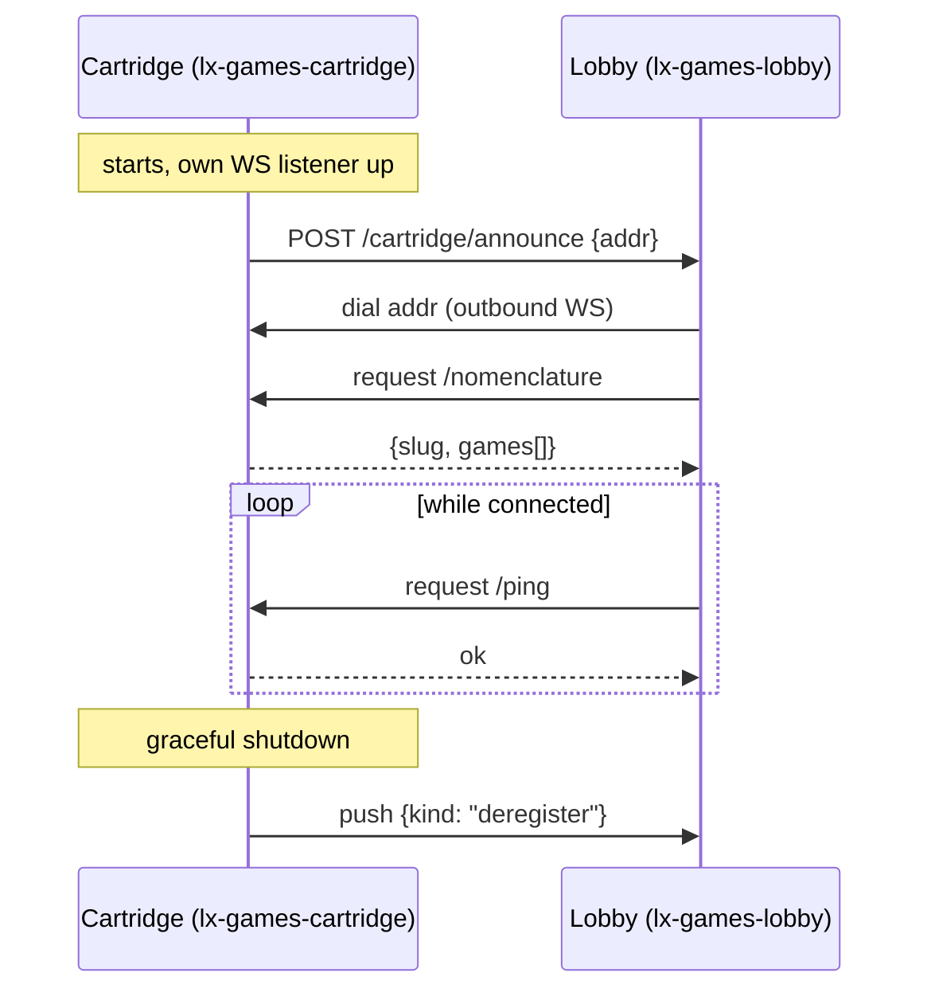

# Repository `lx-games`

Board games platform on top of [lxgo](https://github.com/epicoon/lxgo). Two
independent Go modules/services:

- **`lx-games-lobby`** - the browser-facing hub. Tracks a configured set of
  cartridges, keeps a live WS connection to each, aggregates their game
  nomenclature and active rooms.
- **`lx-games-cartridge`** - a cartridge: a game-hosting process. Reports its own
  slug and game nomenclature to whichever lobby it's told about; the lobby
  is what actually holds the connection. Several cartridge processes can
  share the same slug (load-balancing nodes of the same cartridge).

Each is independently deployable - see its own `README.md` for local/Docker
setup.

## Protocol

A cartridge already listed in the lobby's own `Cartridges` config gets
dialed on the lobby's own startup too, without waiting for an `announce`.
`/rooms` (active game instances) is requested the same way as
`/nomenclature`, on demand.

## Registry state (lobby side, per cartridge node)

- `Dead` - not connected, nothing scheduled. Starting state; also where a
  graceful deregister or an exhausted retry budget ends up.
- `PendingRetry` - was `Connected`, a ping or dial just failed; retried on
  a timer up to `MaxRetries`, then `Dead`.
- `Connected` - live WS connection, cached nomenclature.
- `Corrupted` - connected at the transport level, but every game it
  reported conflicted with an already-registered node's data under the
  same key (version/config mismatch, not a connectivity problem).
  Terminal: automatic paths (announce, config reload) leave it alone; only
  a deliberate manual reconnect revives it.

A partial nomenclature conflict (some games conflict, some don't) rejects
just the conflicting entries and logs it, without affecting the node's
own connection state.
