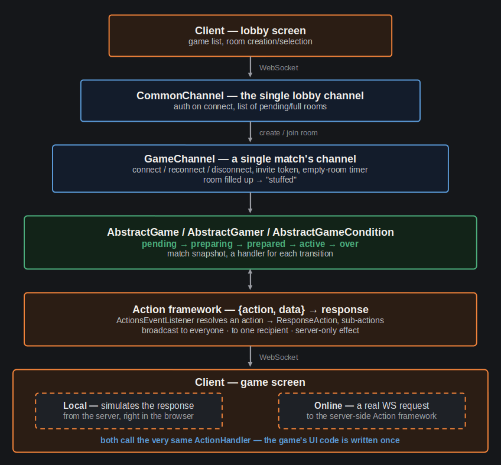
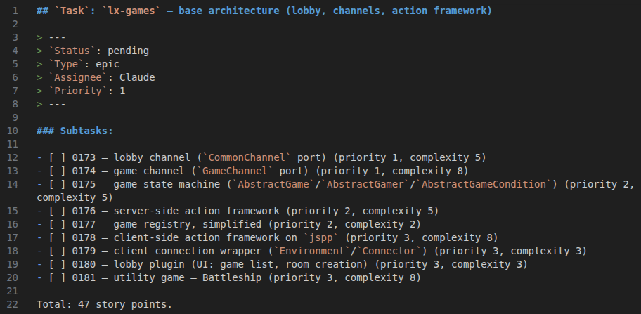

[LinkedIn](https://www.linkedin.com/pulse/lets-go-play-aleksei-sedov-btcuf)

# Let's Go Play!

---

> #### Epigraph
> *The best way to understand a technology is to build it from scratch yourself.*

Greetings, dear reader!

Today I'm starting something new for myself. I've long wanted to tell a
story, but never got around to it. My previous work project has just wrapped
up, so I finally have the free time to write a series of articles.

For quite a while now, I've been building my own web framework - from
scratch, deliberately avoiding existing solutions. What emerged is a
full-fledged stack that's already tested, documented, and publicly
available.

In a nutshell:
* Writing a web framework is one of my hobbies.
* I recently finished porting it from PHP to Go. The ecosystem is called
  `lxgo`.
* Now I want to start porting my board game engine (built on top of the
  earlier PHP version).
* The goal is to build something bigger than just a pet project. Anyone
  should be able to deploy the game engine with any set of games built on
  a shared architecture.
* I'm planning to work alongside `Claude Code` (no vibe-coding here!).
* I want to make the process public - I'll be writing progress-report
  articles, showing not just the project itself, but how the work behind
  it is organized.

The framework lives here - [https://github.com/epicoon/lxgo](https://github.com/epicoon/lxgo)

The games will live here - [https://github.com/epicoon/lx-games](https://github.com/epicoon/lx-games)

Beyond the summary, I'd like to share my thinking in more detail. So if
you're curious, I invite you to dive a little into the backstory and the
finer points of my plan `:)`

## Where This All Came From

I've been in web development for over 10 years, and my original stack was
PHP + JS. Naturally, the framework was originally written in that same
stack. Even back then it grew into a full ecosystem: server-side request
dispatching and handling, console command tooling, a component-based
application model, real-time channels over WebSocket, YAML model schemas
with auto-generated migrations, a custom JS preprocessor for the frontend,
and much more.

This project was an outlet for me. No deadlines, no client requirements -
just the question "how would I do this myself?" If the first attempt came
out badly, I could just calmly rewrite the whole thing from scratch `:)`

Over time, this hobby grew into several personal projects, and the games
platform became the most complete one of them. It has a lobby, real-time
channels, a client-server action-exchange framework, and a dozen
well-known board games adapted for the browser. My friends and I would
play from time to time. But the real enjoyment came less from the games
themselves and more from building the whole thing.

A multiplayer game engine is not exactly trivial: you need a layer of
channels and connections, game-state synchronization between players,
handling of reconnects and dropped connections, and a "local" mode where
the server is simulated right in the browser - running the very same game
logic that also works online.

## Why Now

A couple of years ago I discovered Go and fell in love. A classic story, I
know - the PHP developer who switches to Go. I got caught in that net too,
and I don't regret it. PHP has, of course, come a long way over the last
10 years, but Go is a completely different kind of language, and its
philosophy really clicked with me.

Right now I'm between projects: the previous chapter has closed, and
instead of just sending out resumes and waiting, I decided to use this
time consciously - both as a developer, and as a writer who's finally
putting into words what he actually does.

## What I'm Planning for the Game Engine

On paper it's simple, but the implementation is where it gets interesting:
first the base gets ported - the lobby, real-time channels, the
client-server request/response framework - all built on `lxgo`. Before
touching a single real game, I'll run this whole architecture through a
simple new game, also written "live" - something like Battleship. The
goal is purely to validate: does the whole infrastructure actually work,
from connecting to the very end of a match.

Only after that comes the porting of the actual games from the old
platform, starting with the two most mature ones. The original had no
mobile adaptation, and I think we'll tackle that too. After that - a
couple more games, which will also get a visual redesign along the way.

None of the games are my own game design - they're all adaptations of
well-known board games, whose mechanics aren't protected by copyright
(unlike the ready-made artwork, which I'll be redrawing myself).

## How This Will Be Done

I'll be working with modern technology. Working alongside Claude Code, but
strictly no vibe-coding. I have a set of skills and an already-proven
workflow, so this will simply be part of my usual working process: tasks
get broken down, estimated, go through independent review, documentation
gets updated together with the code - the same disciplined process I
built for a team of developers made of proteins and nucleic acids. Not
using AI in development today is madness. Even constantly refining a
predictable development process with a quality outcome is still very much
a case of Carroll's "it takes all the running you can do to stay in the
same place". Skip that, and you'll fall far behind. On the other hand,
trust the language model too much, drop your guard, and you'll end up with
chaos you can no longer control. So - the goal is balance: stay balanced,
be friends with the model, and have a good time along the way.

And, jumping ahead a little: `lxgo` is already being used for more than
just games - I have, for instance, a decent head start on a drum machine.
That project could realistically grow into a full-blown synthesizer. The
gaming platform isn't the final destination. If things turn out
interesting, there'll be a sequel.

## What's Next in This Series

The next articles will be periodic mini-reports on the work done: about
the base architecture itself, how the client-server action exchange
works, what I carried over from the old PHP version as-is, and what I
rethought from scratch for Go. Possibly seasoned with some general
musings along the way.

After that we'll get to the first utility game, then the porting of the
existing ones.

I hope it'll be interesting to watch an engineering project get built,
and to see how human thought and neural-network thought weave together,
symbiotically.

For convenience, I'll repeat the important links:
* The framework we'll be using - [https://github.com/epicoon/lxgo](https://github.com/epicoon/lxgo)
* Where we'll be working on the game engine - [https://github.com/epicoon/lx-games](https://github.com/epicoon/lx-games)

Thanks for your interest - I'll be glad to hear your comments and
questions `:)`
