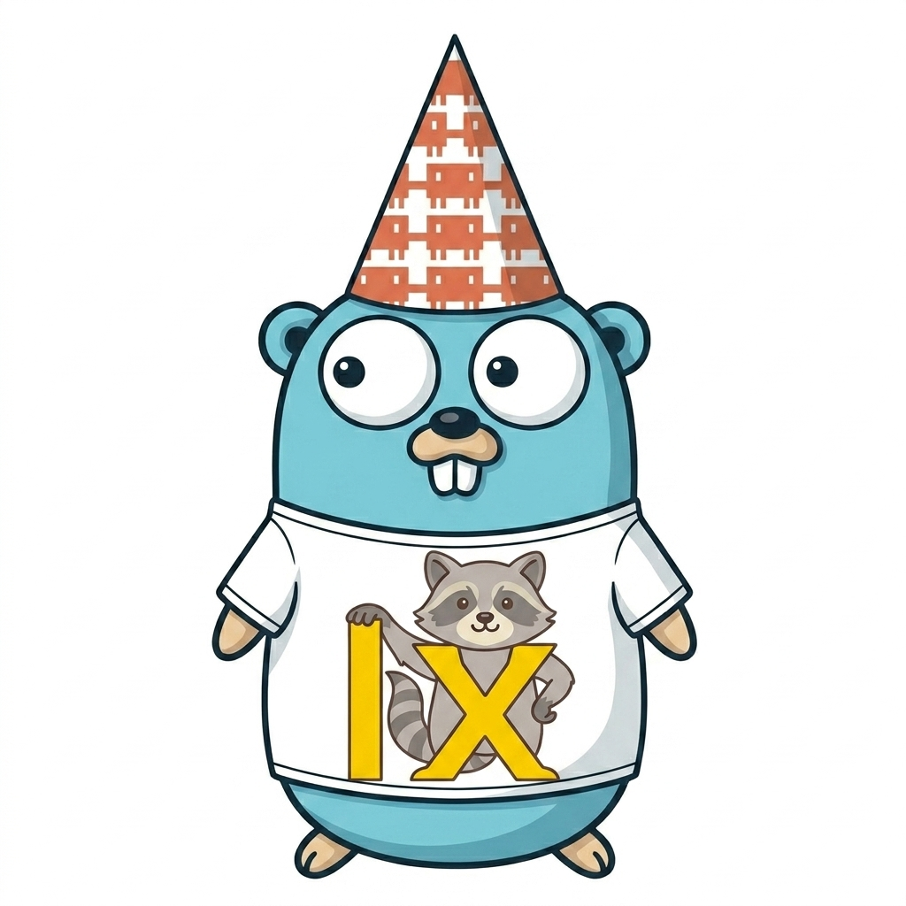
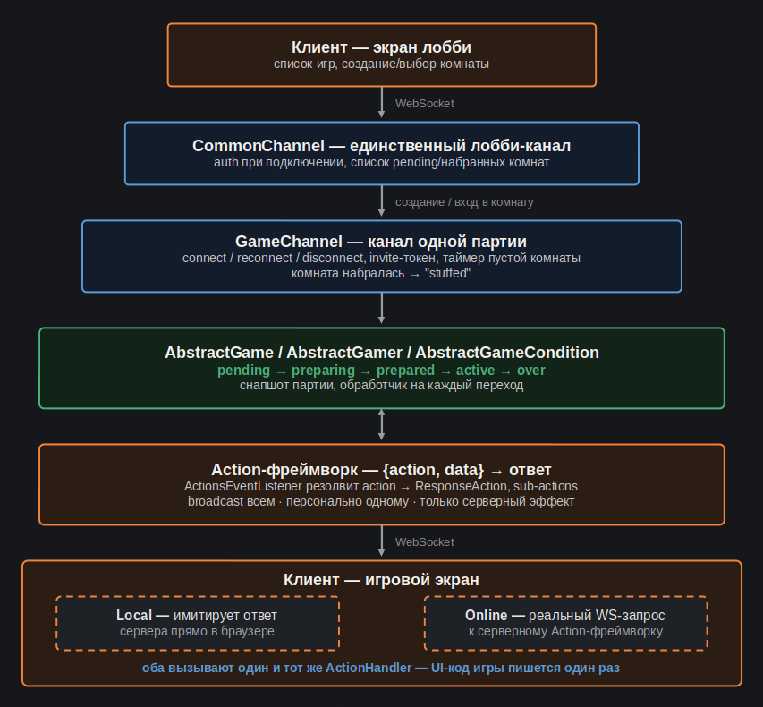
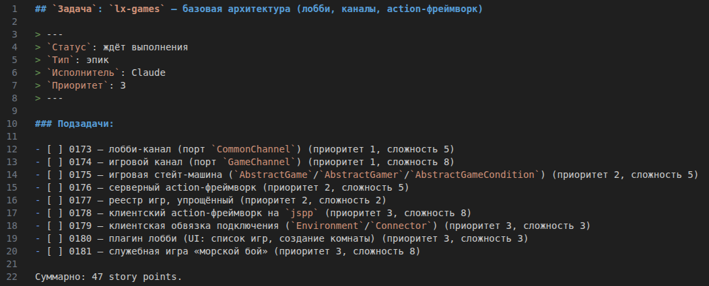

[LinkedIn](https://www.linkedin.com/pulse/lets-go-play-aleksei-sedov-btcuf)

# Go, поиграем!

---

> #### Эпиграф
> *Лучший способ понять технологию — построить её с нуля самому.*

Приветствую моего уважаемого читателя!
Сегодня я хочу начать нечто новое для себя. Давно хотел рассказать
историю, но руки не доходили. Сейчас предыдущий рабочий проект завершён, поэтому
появилось свободное время, чтобы написать цикл статей.

Уже достаточно давно я строю собственный веб-фреймворк. С нуля, сознательно избегая
чужих решений. Выстроился полноценный стек, который уже протестирован, задокументирован
и находится в открытом доступе.

В двух словах, тезисно:
* Есть у меня такое развлечение - веб-фреймворк писать.
* Недавно я закончил портировать его с PHP на Go. Экосистема получила название `lxgo`.
* Сейчас хочу начать перенос моего движка для настольных игр (реализован на базе прошлой
PHP-версии).
* Цель - построить что-то большее, чем просто пет-проект. Игровой движок можно будет
развернуть любому желающему, с любым набором игр, реализованных по общей архитектуре.
* Планирую работать совместно с `Claude Code` (не вайбкодинг!).
* Хочу сделать процесс публичным - буду писать статьи-отчёты о проделанной работе,
чтобы показать не только сам проект, но и то, как организована работа над ним.

Фреймворк живёт тут - [https://github.com/epicoon/lxgo](https://github.com/epicoon/lxgo)

Игры будут жить тут - [https://github.com/epicoon/lx-games](https://github.com/epicoon/lx-games)

Помимо саммари, хочется поделиться своими соображениями поподробнее. Так что, кому
интересно - приглашаю немного погрузиться в предысторию и дополнительные детали моего
плана `:)`

## Откуда это вообще взялось

В вэб-разработке я уже больше 10 лет, и изначально мой стек был PHP + JS. Соответственно,
фреймворк изначально тоже писался на этом стеке. Уже тогда выстроилась полноценная
экосистема с диспетчеризацией и обработкой запросов на сервере, организацией консольных
команд, компонентной моделью приложения, real-time каналами поверх WebSocket, YAML-схемами
моделей и автогенерацией миграций, собственным JS-препроцессором для фронтенда и многим
другим.

Этот проект был для меня отдушиной. Никакого дедлайна, никаких требований
заказчика, только вопрос "а как бы я сделал это сам". Если с первого раза
получалось плохо, можно было спокойно всё переписать с нуля `:)`

Со временем из этого увлечения выросло несколько личных проектов, а игровая часть стала
самой законченной из них. Там есть лобби, real-time каналы, фреймворк обмена действиями
между клиентом и сервером, десяток известных настольных игр, адаптированных под браузер.
Мы с друзьями периодически играли. Но больше удовольствия я получал не от игр, а от того,
чтобы всё это построить.

Существующий движок для многопользовательских игр - вещь не самая тривиальная: нужен слой
каналов и подключений, синхронизация состояния партии между игроками, обработка реконнектов
и разрывов связи, режим "локальной" игры, где сервер имитируется прямо в браузере, для той
же самой игровой логики, что работает и онлайн.

## Почему сейчас

Пару лет назад я открыл для себя Go и влюбился. Классическая история, я знаю - PHP-разработчик
переходит на Go. И я тоже попал в эти сети, но не жалею. PHP, конечно, сильно развился за
последние 10 лет, но Go язык совершенно другого формата, мне очень зашла его философия.

Сейчас я между проектами: предыдущая глава закрылась, и вместо того, чтобы просто рассылать
резюме и ждать, я решил использовать это время осознанно - и как разработчик, и как автор,
который наконец пишет о том, что делает.

## Что планирую по поводу игрового движка

На бумаге всё просто, но в реализации будет интересно: сначала переносится сама база -
лобби, real-time каналы, фреймворк запрос/ответ между клиентом и сервером - всё с
использованием `lxgo`. Прежде чем трогать хоть одну настоящую игру, я прогоню всю эту
архитектуру через простенькую новую игру, которую напишу тоже в "прямом эфире" - что-то
вроде морского боя. Цель - чисто проверка: работает ли инфраструктура целиком, от
подключения до конца партии.

И только после этого - перенос настоящих игр из старой платформы, начиная с двух самых
зрелых. В оригинале не было адаптации под мобильные устройства, и думаю, этим тоже займёмся.
Дальше — ещё пара игр, которым заодно предстоит и визуальный редизайн.

Ни одна из игр - не мой собственный геймдизайн, это всё адаптации известных настольных игр,
механики которых не защищены авторским правом (в отличие от готовых изображений - их я буду
перерисовывать).

## Как это будет делаться

Работать будем, используя современные технологии. Работаем вместе с Claude Code, но строго
никакого вайбкодинга. У меня есть набор скиллов, есть уже отработанная схема. Так что это
будет как часть моего обычного рабочего процесса. Задачи декомпозируются, оцениваются,
проходят независимое ревью, документация обновляется вместе с кодом - тот же
дисциплинированный процесс, который я строил для команды разработчиков из белков и
нуклеиновых кислот. Сегодня не пользоваться ИИ в разработке - безумие. Даже постоянно
совершенствоваться в построении предсказуемого процесса разработки с качественным
результатом - это всё равно, что "чтобы стоять на месте, нужно бежать" по Кэрроллу.
Не будешь этим заниматься - останешься далеко позади. С другой стороны, слишком доверишься
языковой модели, недоглядишь и получишь хаос, которым уже не сможешь управлять. Поэтому будем
выдерживать баланс, дружить и приятно проводить время.

И, забегая вперёд: `lxgo` уже сейчас используется не только под игры - у меня, например,
есть неплохой задел для драм-машины. Этот проект вполне реально дорастить до полноценного
синтезатора. Игровая платформа - не конечная точка. Если получится интересно, будет и продолжение.

## Что дальше в этой серии

Следующие статьи будут периодическими миниотчётами о проделанной работе:
про саму базовую архитектуру, как устроен обмен действиями между клиентом и сервером,
что я взял из старой PHP-версии как есть, что переосмыслил заново под Go. Возможно,
с примесью общих рассуждений о происходящем.

Дальше доберёмся до первой служебной игры, потом перенос уже существующих.

Надеюсь, будет интересно наблюдать, как строится инженерный проект и
как полёт мысли человеческой симбиотически сплетается с мыслью нейросетевой.

Для удобства, продублирую важные ссылки:
* Фреймворк, который будем использовать - [https://github.com/epicoon/lxgo](https://github.com/epicoon/lxgo)
* Где будем работать с игровым движком - [https://github.com/epicoon/lx-games](https://github.com/epicoon/lx-games)

Спасибо за ваш интерес, буду рад комментариям и вопросам `:)`
