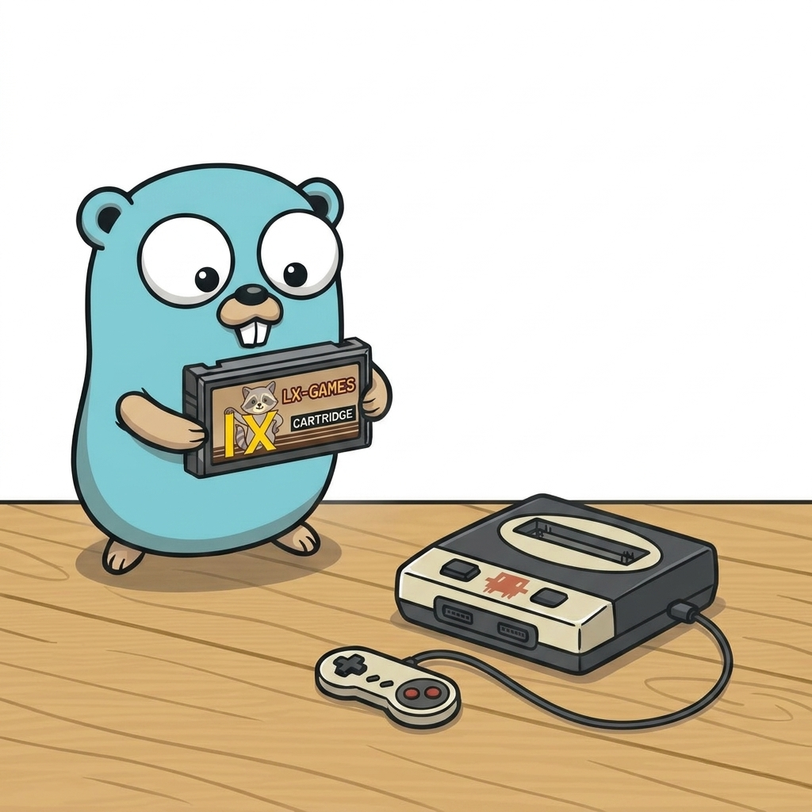
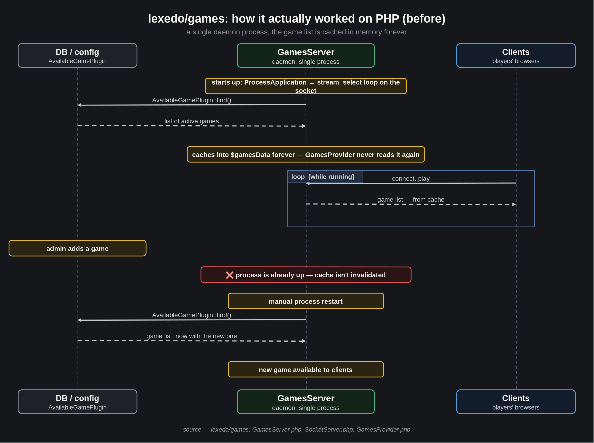
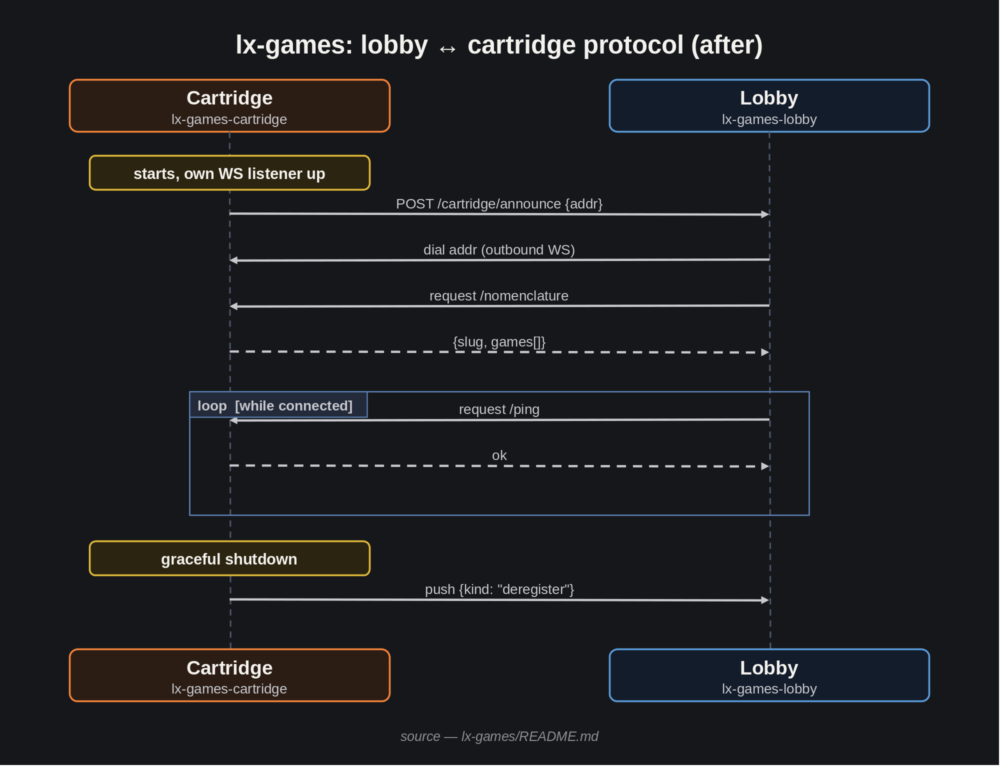
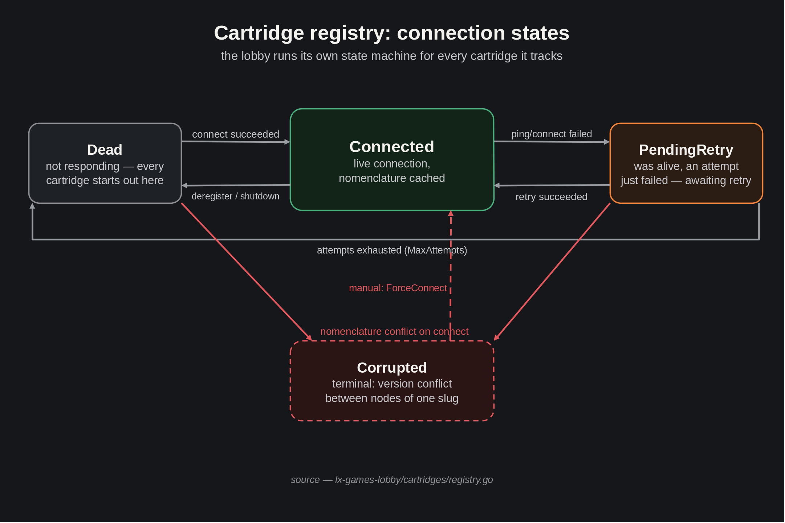

[LinkedIn](https://www.linkedin.com/pulse/lets-go-play-part-2-how-we-argued-ai-architecture-aleksei-sedov-so6hf/)

# Let's Go Play! Part 2: How We Argued With AI About Architecture

---

> #### Epigraph
> *A plan is something that will almost certainly change - but without one, there'd be nothing to change.*

Greetings again!

[Last time](https://www.linkedin.com/pulse/lets-go-play-aleksei-sedov-btcuf/)
I told you what I was setting out to do: port my game engine from PHP to
Go, work alongside Claude Code, and keep a diary about it. Back then there
wasn't a single line of code yet - just a plan. Today there's already some
code, not much of it, but there's an architecture now. And, most
importantly, there's a story about how Claude Code and I got there.

## The First Idea We Had to Rethink

The PHP version was a monolith. It was a daemon - one long-lived process
listening on a socket on a fixed port. That's an unusual lifecycle for a
PHP application, but a natural one for a WebSocket server. The list of
available games was set in the app's config. Game code was pulled in
dynamically, the way PHP does that natively - class autoloading. Which was
convenient: different games could easily live in different composer
packages, and a single lobby would pull them all together just by knowing
about them through the config. But there was a real technical shortcoming
too - for the app to notice a change in the list of available games, it
had to be restarted.

That won't fly in Go - there's no set of files an interpreter picks up on
demand, just one compiled binary. Which raised a question: if a game's
code can't be pulled into an already-running process on the fly, how do
you plug games in and out at all? And ideally without restarting the
lobby application itself - the very process holding all the players.

Claude and I opened a discussion. First we looked at what Go offers out of
the box - there's a native `plugin` package for dynamic code loading.
Rejected right away: it's basically useless in production. The plugin and
the host have to be built with the exact same Go version and the exact
same dependency versions down to the patch number, and there's no way to
unload an already-loaded plugin - the only way back is restarting the
process. Technically the capability exists, but in practice you'll never
actually get to use it.

Clearly we'd run straight into a problem that just doesn't carry over from
PHP to Go. So the right move is to act idiomatically for Go instead. If
code can't be plugged in dynamically inside one process, then let's stop
keeping the game and the lobby in one process at all. The lobby now
becomes its own separate service. Each game-hosting application is a
separate service too, and there can be as many of them as you like,
freely started and stopped in parallel. That's also where the name
"cartridge" came from: plug in a new cartridge, and a new game shows up in
the lobby. Getting the services' API right also solved a problem we
hadn't cracked before - keeping the game list current without any
restarts.

Bottom line - a microservice architecture where, in practice, plugging
games in and out is just as easy as it once was in PHP, only now without
any lobby restarts at all. Plus a bonus we hadn't even thought about while
designing all this: since a game is just a service at its own address,
nothing stops you from running several nodes of the same game for load
balancing. That was never even on the table before - a monolith just
doesn't slice up into pieces like that. To me that's always a sign of
good architecture: when useful functionality falls out naturally.

## The Second Fork: Whose WebSocket?

Now that a game is its own process - how does the client even talk to it?
The obvious option: give every game its own WebSocket server, and have
the browser connect to it directly. We discussed that option and rejected
it. It has two unpleasant downsides. First, the client would have to keep
two independent connections open at once - the lobby channel and the game
channel - each with its own reconnect cycle, which will sooner or later
drift out of sync with each other on a bad network. Second, every game
would have to validate the user's token itself and track its own open
matches - a chunk of infrastructure duplicated inside every single game
package.

We settled on something else: a single WebSocket, on the lobby. The
player never connects to a game directly - the lobby proxies their
actions onward. Authorization happens once, at the boundary, and the
game receives an already-validated player. And - a nice side effect - the
game now knows nothing at all about how players connect, so it can be
plugged into a completely different lobby architecture if one is ever
needed.

## How a Game Tells the Lobby "I'm Here"

A bit more detail on the API I already mentioned: how does the lobby find
out which game processes even exist? The simplest solution: a static list
of addresses (host:port) in the lobby's config - spin up a game process,
add its address by hand, and the lobby picks it up. That'll work, but
this is exactly the spot where I wanted automation.

The solution that suggested itself: instead of the lobby polling a list,
the game process knocks on the lobby's door itself on startup - "I'm
here, this is my address." The lobby responds by opening a WebSocket
connection back and asking the game for its nomenclature (which games it
actually hosts - one application can carry several games at once). That
way, the initiative sits with whoever actually just showed up.

Except this solution doesn't close the reverse problem. What if it's not
the game process that comes up after the lobby, but the other way around
- the lobby restarts while the game processes are already happily
running? Nobody's going to "knock" on the lobby at that point. The
resolution: the lobby still keeps a list of addresses it's allowed to
poll in its config, but uses it only as a starting point - on its own
startup it walks that list and opens connections to whoever's already
alive. From then on, the self-announcing "I'm here" mechanism takes over
for any newly started game processes. And there's another architectural
bonus here too - the list isn't just a starting point, it's also a
validator: not just any process can announce itself as a cartridge, only
one whose address is already listed in the lobby.

## What We Ended Up With

Cartridges (that's the name I ended up giving the game processes, by
analogy with old game consoles) - plug in a cartridge, and a game shows
up. The protocol between the lobby and a cartridge looks like this:

1. A cartridge starts up, brings up its own WebSocket server, and knocks
   on the lobby once over HTTP - "I'm here, this is my address."
2. The lobby opens a connection back, requests the nomenclature (the
   list of games this cartridge hosts) - and from then on pings it
   periodically to know whether it's still alive.
3. On a clean shutdown, the cartridge warns the lobby itself, over the
   channel that's already open.

Internally, the lobby runs a small state machine per cartridge: alive and
connected, waiting to retry after a failure, dead for good - or, as a
separate case, "corrupted." That last one happens when two cartridges
sharing the same slug (several nodes of the same cartridge, for load
balancing) suddenly report conflicting nomenclature data. That's a plain
configuration conflict, not something a retry can fix, so the state
deliberately gets stuck there until someone sorts out by hand what
drifted apart.

And since the boundary between the lobby and a game is now a network one,
not an in-process one, it would've been a shame not to follow that
through all the way. Both services get wrapped in Docker independently of
each other, each can be deployed on its own machine, and all they know
about their neighbor is its external address. What came out of it is a
neat architecture with a set of solutions that close off a whole range of
problems naturally.

## What's Next

Next comes the actual code: player authorization, the architecture behind
creating games and joining them, the game process itself. After that,
we'll get to the first utility game, to run this whole architecture
through the simplest possible, but real, game loop from start to finish.
After that - porting the real games over from the old platform, more on
those later.

For convenience, here are the important links again:
* The framework - [https://github.com/epicoon/lxgo](https://github.com/epicoon/lxgo)
* The game engine - [https://github.com/epicoon/lx-games](https://github.com/epicoon/lx-games)

Thanks for reading - and, as always, I'll be glad to hear your comments
and questions `:)`
