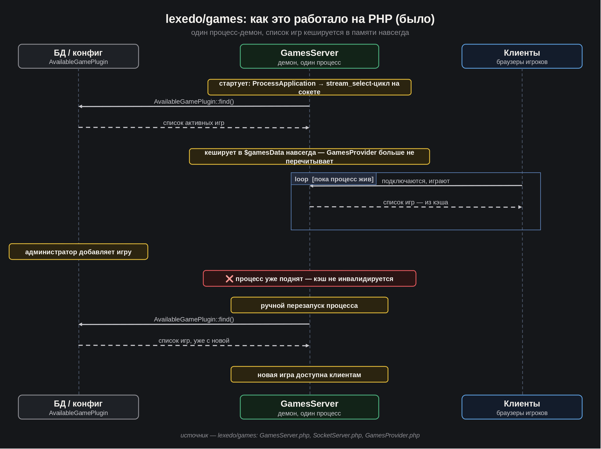
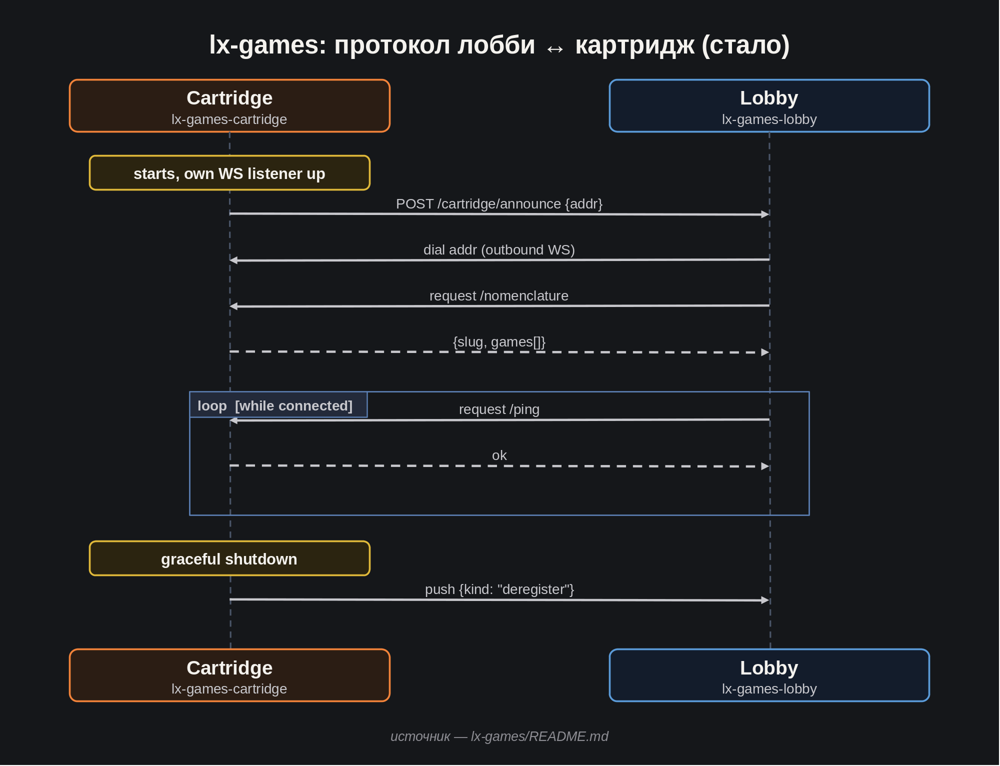
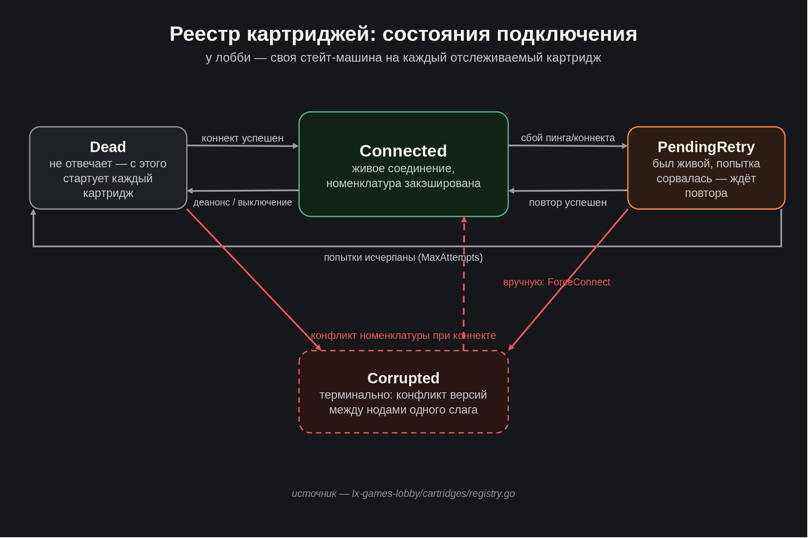

[LinkedIn](https://www.linkedin.com/pulse/lets-go-play-part-2-how-we-argued-ai-architecture-aleksei-sedov-so6hf/)

# Go, поиграем! Часть 2: как мы с ИИ спорили об архитектуре

---

> #### Эпиграф
> *План — это то, что почти наверняка изменится, но без него меняться было бы нечему.*

Приветствую снова!

В [прошлый раз](https://www.linkedin.com/pulse/lets-go-play-aleksei-sedov-btcuf/)
я рассказал, что затеял: перенести свой игровой движок с PHP на Go,
работать в связке с Claude Code и вести об этом дневник. Кода тогда
не было ни строчки - только план. Сегодня код уже есть, хоть и не много,
зато появилась архитектура. И, самое главное, есть история о том, как мы
с Claude Code к ней шли.

## Первая идея, которую пришлось переосмыслить

PHP-версия была монолитом. Она представляла из себя демона - один долгоживущий
процесс, слушающий сокет на определённом порту. Это было нехарактерное решение
в отношении жизненного цикла PHP приложения, но естественно для вэбсокет-сервера.
Список доступных игр задавался в конфиге приложения. Код игр подтягивался динамически,
уже нативным для PHP способом - автозагрузкой классов. И это было удобно: разные игры
вполне могли жить в разных composer-пакетах, а единое лобби собирало их все вместе,
просто зная о них через конфиг. Но была и серьёзная техническая недоработка - чтобы
приложение заметило изменение в списке доступных игр, его нужно было перезапускать.

В Go так не выйдет - у нас не набор файлов, которые интерпретатор подхватывает по
требованию, а один скомпилированный бинарник. Возник вопрос: если код игры нельзя
подтянуть в уже работающий процесс на лету, как тогда подключать и отключать игры?
Причём сразу учесть, что желательно это делать без перезапуска лобби-приложения,
того самого процесса, который держит на себе всех игроков?

Открыли с Клодом дискуссию. Первым делом посмотрели, что Go вообще предлагает из
коробки - есть родной пакет `plugin` для динамической загрузки кода. Отвергли
сразу: в проде он практически бесполезен. Плагин и хост обязаны быть собраны
одной и той же версией Go и всех зависимостей вплоть до патч-версии, а
выгрузить уже загруженный плагин нельзя -
единственный откат назад - рестарт процесса. Формально возможность
есть, а по факту не пригодится ни разу в жизни.

Очевидно, что мы сразу же столкнулись с проблемой, напрямую непереносимой
с PHP на Go. Значит, нужно действовать идеоматически для Go. Раз код нельзя
подключать динамически внутри одного процесса, перестаём держать игру и лобби
в одном процессе вообще. Лобби теперь будет рассматриваться как отдельный сервис.
Каждое приложение с играми - тоже отдельный сервис, и таких приложений может
быть сколько угодно, их можно спокойно поднимать и останавливать параллельно.
Тут же родилось и название - «картридж»: вставил новый картридж, и в лобби
появилась новая игра. Правильно организовав API сервисов, добились и ранее
нерешённой задачи - актуализация списка игр без перезапусков.

В сухом остатке - микросервисная архитектура, где на практике так же
просто подключать и отключать игры, как когда-то было в PHP, только
безо всяких рестартов лобби вообще. И бонус, о котором мы даже не
думали, когда всё это проектировали: раз игра - это просто сервис на своём
адресе, ничто не мешает поднять сразу несколько нод одной и той же игры
для балансировки нагрузки. Раньше об этом даже речи не шло, монолит на
такие куски просто не резался. Для меня это всегда признак хорошей
архитектуры, когда полезный функционал реализуется естественным образом.

## Вторая развилка: чей WebSocket?

Раз игра теперь отдельный процесс - как клиент вообще с ней
разговаривает? Вариант «в лоб»: у каждой игры свой WebSocket-сервер,
браузер подключается к нему напрямую. Мы этот вариант обсудили и
отклонили. У него два неприятных минуса. Во-первых, клиенту приходится
поднимать два независимых соединения одновременно - лобби-канал и
игровой - и у каждого свой цикл переподключения, которые рано или
поздно разъедутся между собой при плохой сети. Во-вторых, каждой игре
пришлось бы самой валидировать токен пользователя и самой вести учёт
открытых партий - кусок инфраструктуры дублировался бы в каждом
игровом пакете.

Остановились на другом: единственный WebSocket - у лобби. Игрок
никогда не коннектится к игре напрямую, лобби проксирует его экшены
дальше. Авторизация проходит один раз, на границе, игра получает уже
провалидированного игрока. И - приятный побочный эффект - игра теперь
вообще ничего не знает про способ подключения игроков, её можно
воткнуть в любую другую лобби-архитектуру, если она вдруг понадобится.

## Как игра говорит лобби «я тут»

Чуть подробнее об уже упомянутом API: откуда лобби узнаёт, какие игровые
процессы вообще существуют? Самое простое решение - статический список
адресов (хост:порт) в конфиге лобби: подняли игровой процесс, руками
добавили его адрес, лобби подхватила. Работать будет, но именно тут
хотелось автоматизации.

Решение, которое напрашивалось само собой - не лобби опрашивает список,
а игровой процесс сам стучится в лобби при старте - «я тут, вот мой
адрес». Лобби в ответ сама устанавливает обратное WebSocket-соединение
и спрашивает у игры её номенклатуру (какие игры она вообще хостит -
одно приложение может нести несколько игр сразу). Таким образом,
инициатива у того, кто реально только что появился.

Но только это решение не закрывает обратную проблему. Что, если не игровой
процесс поднимается после лобби, а наоборот - лобби перезапускается, пока
игровые процессы уже спокойно работают? Никто в лобби в этот момент
уже не «постучится». Итог: лобби всё-таки держит в конфиге список
адресов, которые ему разрешено опрашивать, и использует его как стартовую
точку - при своём старте само проходит по этому списку и поднимает
соединения к тем, кто уже жив. А дальше уже работает механизм
самостоятельных «я тут» от вновь поднимаемых игровых процессов. И опять
же архитектурный бонус - список является не просто стартовой точкой, но и
валидатором: заявить о себе картриджем может не любой процесс, а только
тот, чей адрес заранее прописан в лобби.

## Что в итоге получилось

Картриджи (как я в итоге назвал игровые процессы, по аналогии со
старыми игровыми приставками): воткнул картридж - появилась игра.
Протокол между лобби и картриджем выглядит так:

1. Картридж стартует, поднимает свой WebSocket-сервер и один раз
   стучится в лобби по HTTP - «я тут, вот мой адрес».
2. Лобби устанавливает обратное соединение, запрашивает номенклатуру
   (список игр, которые хостит этот картридж) - и дальше периодически
   пингует, чтобы знать, жив ли он ещё.
3. При аккуратном выключении картридж сам предупреждает лобби через
   уже установленный канал.

У лобби внутри - маленькая state-машина на каждый картридж: жив и
подключён, ждёт повторной попытки после сбоя, окончательно мёртв -
или, как отдельный случай, «повреждён». Последнее - когда два
картриджа с одним и тем же слагом (несколько нод одного и того же
картриджа для балансировки нагрузки) вдруг присылают противоречащие
данные о своей номенклатуре. Это явный конфигурационный конфликт,
так что состояние подвисает намеренно, пока кто-то руками не разберётся,
что там разъехалось.

И раз уж граница между лобби и игрой теперь сетевая, а не внутрипроцессная,
грех было не довести это до конца. Оба сервиса заворачиваются в
Docker независимо друг от друга, каждый может разворачиваться на своей
машине, о своём соседе они знают только по внешнему адресу.
Получилась симпатичная архитектура с набором решений, закрывающих
целый ряд проблем естественным образом.

## Что дальше

Дальше - собственно код: авторизация игроков, архитектура, обеспечивающая
создание игр, присоединение к играм, сам игровой процесс. После, сможем
добраться до первой служебной игры, чтобы прогнать всю эту архитектуру через
максимально простой, но реальный игровой цикл от начала до конца.
Дальше - перенос настоящих игр из старой платформы, про них разговор ещё впереди.

Для удобства, продублирую важные ссылки:
* Фреймворк - [https://github.com/epicoon/lxgo](https://github.com/epicoon/lxgo)
* Игровой движок - [https://github.com/epicoon/lx-games](https://github.com/epicoon/lx-games)

Спасибо, что читаете — и, как обычно, буду рад комментариям и вопросам `:)`
