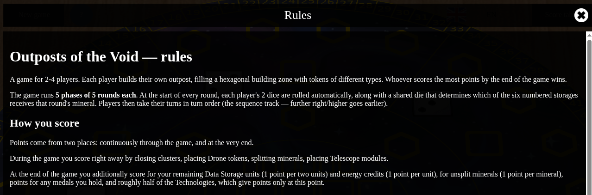

[LinkedIn](https://www.linkedin.com/pulse/lets-go-play-part-3-what-matters-more-plan-aleksei-sedov-t0upf)

# Let's Go Play! Part 3: What Matters More - the Plan or the Flexibility?

---


> #### Epigraph
> *Emotions, too, can point you the right way.*

Greetings again!

[Last time](https://www.linkedin.com/pulse/lets-go-play-part-2-how-we-argued-ai-architecture-aleksei-sedov-so6hf/)
things wrapped up with the lobby↔cartridge architecture - there wasn't a
single actual game yet. Today's report is a bit off-topic: almost
everything I worked on this round is frontend, Go only made a passing
appearance. But I promised regular reports, so I'm writing about what's
been done - and quite a lot has been.

And finally there's something alive to show. I'll also tell how my
approach has changed.

## Adjusting the Plan

Originally the plan was: first the base (lobby, channels, the action framework, the
game state machine), then a simple utility game like Sea Battle to run
the whole architecture through its paces, and only after that - porting
the real games from the old platform.

It turned out differently. Sea Battle never happened - nostalgia got the
better of me, I dove into one of the old games, and decided a separate
proving step was redundant: the architecture can just as well get broken
in on a real game instead. It's also simpler and clearer for me to keep
moving through the planned steps this way. So there won't be a "helper"
game after all - but instead, a game I'd originally planned to do last,
as the biggest one, shows up much sooner.

The moral from the last article repeats itself in a new form: a plan is
something that will almost certainly change. This time the reason for
the change wasn't a technical fork in the road, but a plain emotional
one: I just wanted to play, not write test code for its own sake.

## Meet Outposts of the Void

As I mentioned in earlier articles, I had a reskin stage planned for the
original game - what came out of it is a eurogame set in space: Outposts
of the Void. The theme and visuals are completely changed.


The offline version works right now: open it in a browser and play with
two, three, or four players on one screen, no server, no network. The
full game loop - from starting a match to finishing it - already runs
end to end.


## A Small Piece of Engineering

Now that the offline version is alive, putting it in front of an
audience meant fixing some obvious gaps I'd been ignoring. What happens
if you refresh the page mid-match? Before, the match would just vanish.
Fixed now: after every action, the match state is quietly saved to
`localStorage`, and it's just as quietly restored on the next page load.

The interesting part isn't the saving itself, but that I barely had to
write any new code for it. The online mode already had a mechanism for
restoring state after a reconnect - the server sends a snapshot of the
match, and the client lays out the board, players, dice, and scores from
it. For offline, I reused exactly that same mechanism - just with
`localStorage` as the snapshot source instead of the server.

Along the way, of course, there were a couple of real bugs: restoring
state sometimes crashed because one UI component tried to reach a game
object that wasn't fully built yet, and with four players, after a
reload they'd sometimes end up reseated at the wrong spots around the
table.

For the same reason, I also added an in-game rules screen. You used to
be able to just go by the original rules, but after the reskin
everything changed :)



## The One Bit of Go This Time

While doing the reskin, I wanted to keep the old and new versions of the
game deployed at the same time, to check them against each other as I
went - and both versions pull in the same shared JS modules. The only
way to hook up a module used to actually copy it into your own build
map, which meant keeping two synced copies for two parallel versions. I
split module hookup into two kinds: the old way, with copying, and a new
one - the module stays at its real location, and edits to it are picked
up immediately, with no map rebuild.

Separately, I needed to bolt on the rules screen. The text is long and
in markdown - and all text content in my framework already lives in
i18n files. Dragging a huge chunk of markdown straight into a YAML value
as plain text is a clear sign something's wrong with the approach. I
needed an elegant solution that the existing architecture would just
pick up naturally. So now an i18n file's value can hold a reference to
an external file: if the value is `${^path}`, the file's content is
substituted in place of the translation, and if the file has a `.md`
extension, it's immediately run through the markdown renderer (also
part of the framework).

## Try It Yourself

You can already try the offline version locally - no lobby, no network,
just the cartridge with the games:

```
git clone https://github.com/epicoon/lx-games
```

Prepare the local configuration files:

```
cd lx-games/lx-games-cartridge
cp runtime/.env.example runtime/.env
cp runtime/config-local-example.yaml runtime/config-local.yaml
```

Set whichever ports suit you in `runtime/.env`, then build and run (you don't need
Go on your machine - the whole build happens inside Docker)

```
cd runtime
docker compose up -d --build
```

Then open `http://localhost:<the APP_PORT_EXTERNAL value from .env>/ootv`
in your browser.

The `/ootv` route is possibly a temporary solution: the lobby isn't even
needed for offline mode at all (there's nothing to deploy there yet, its
GUI doesn't exist), but the cartridge already knows how to spin up a
game at a direct address on its own. Fair warning: whether this route
stays around long-term isn't settled yet.

## What's Next

The next step is online mode for `Outposts of the Void`: connecting through the lobby,
syncing match state between players over the network. This is exactly
where the architecture from the last article comes in (channels, the
lobby↔cartridge protocol is already partly built) - except we'll be
breaking it in on a real game instead of Sea Battle.

For convenience, here are the important links again:
* The framework - [https://github.com/epicoon/lxgo](https://github.com/epicoon/lxgo)
* The game engine - [https://github.com/epicoon/lx-games](https://github.com/epicoon/lx-games)

Thanks for reading - and, as always, I'll be glad to hear your comments
and questions `:)`
