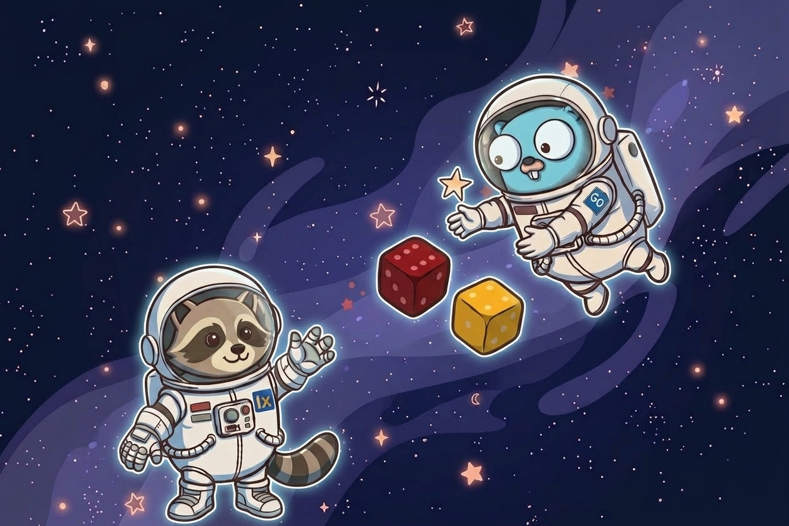
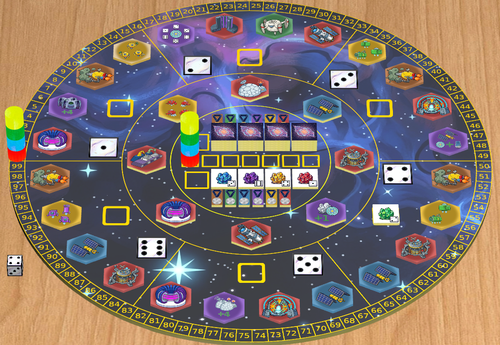
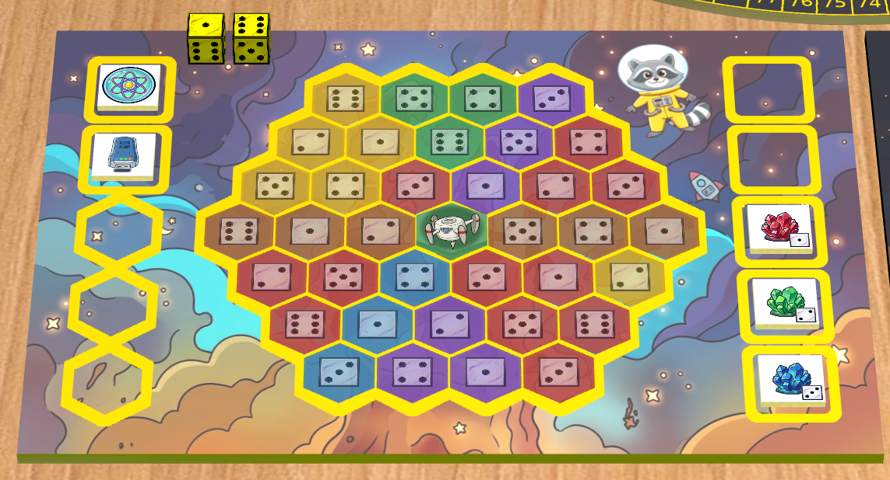
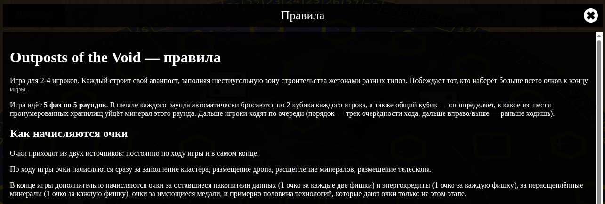

[LinkedIn](https://www.linkedin.com/pulse/lets-go-play-part-3-what-matters-more-plan-aleksei-sedov-t0upf)

# Go, поиграем! Часть 3: что важнее - план или гибкость?

---



> #### Эпиграф
> *Эмоции тоже могут подсказать правильный путь.*

Приветствую снова!

В [прошлый раз](https://www.linkedin.com/pulse/lets-go-play-part-2-how-we-argued-ai-architecture-aleksei-sedov-so6hf/)
дело закончилось архитектурой лобби↔картридж, самой игры не было ни одной.
Сегодня отчёт не совсем по теме: почти всё, с чем работал в этот заход - фронтенд, Go
отметился только по касательной. Но раз обещал регулярные отчёты - пишу
о сделанном, а сделано не мало.

И наконец можно показать что-то живое. Заодно расскажу, как изменился подход.

## Корректировка плана

Изначально планировалось: сначала база (лобби, каналы, action-фреймворк,
игровая стейт-машина), потом - простая служебная игра вроде морского
боя, чтобы прогнать всю эту архитектуру, и только после этого - перенос
настоящих игр со старой платформы.

Получилось иначе. До морского боя дело не дошло - взыграла ностальгия,
я полез в одну из старых игр, и решил, что отдельный проверочный шаг
избыточен: можно с тем же успехом обкатывать архитектуру сразу на реальной
игре. Мне так и проще и понятнее дальше двигаться по намеченным шагам.
В итоге, "вспомогательной" игры не будет, зато значительно раньше появится
игра, которую изначально планировал последней, как самую объёмную.

Из прошлой статьи мораль повторяется в новом изводе: план - это то, что
почти наверняка изменится. В этот раз причина смены - не техническая
развилка, а банальная эмоциональная: захотелось поиграть, а не писать
тестовый код ради теста.

## Знакомьтесь: Outposts of the Void

Как и говорил в предыдущих статьях, мне нужно было предусмотреть этап
рескина оригинальной игры, в итоге получилась евромеханика в космосе:
Outposts of the Void. Полностью изменены тема и визуал.



Сейчас работает офлайн-версия: заходишь в браузер, играешь вдвоём/втроём/
вчетвером за одним экраном, без сервера и без сети. Полный игровой цикл -
от старта партии до конца - уже отрабатывает целиком.



## Маленький инженерный кусочек

Раз офлайн-версия ожила, то чтобы вынести её на суд общественности, решил
доработать некоторые очевидные пробелы, которые игнорировал раньше. Что если
обновить страницу посреди партии? Раньше - партия просто исчезала. Пофиксили:
теперь после каждого действия состояние партии тихо сохраняется в `localStorage`,
а при следующей загрузке страницы так же тихо восстанавливается.

Самое интересное тут не сам факт сохранения, а то, что почти не пришлось
писать новый код. В онлайн-режиме уже был механизм восстановления
состояния после реконнекта - сервер присылает снимок партии, клиент
раскладывает по нему доску, игроков, кости, очки. Для офлайна взяли
ровно тот же механизм, только источник снимка - не сервер, а
`localStorage`.

По дороге, конечно, не обошлось без пары багов: восстановление
иногда падало из-за того, что один компонент интерфейса пытался
обратиться к ещё не до конца созданной игре, а при четырёх игроках после
перезагрузки они иногда рассаживались за столом не на свои места.

И по той же причине, добавил список правил игры. Раньше можно было
руководствоваться оригинальными правилами, но после рескина всё
поменялось :)



## Единственный кусочек про Go в этот раз

Пока делал рескин, хотелось держать старую и новую версии игры
развёрнутыми одновременно, чтобы сверяться друг с другом по ходу
работы - а обе версии тянут общие JS-модули. Раньше единственный способ
подключения фактически копировал внешний модуль в свою карту сборки,
а значит для двух параллельных версий модуль пришлось бы держать в двух
копиях и вручную синхронизировать. Разделил подключение модулей на два вида:
как раньше, с копированием, и новый - модуль остаётся на своём реальном месте,
правки в нём подхватываются сразу, без пересборки карты.

Отдельно понадобилось прикрутить экран с правилами игры. Текст большой,
в markdown - а весь текстовый контент в моём фреймворке и так живёт в
i18n-файлах. Тащить туда огромный кусок markdown прямо текстом внутри YAML -
признак, что делаем очевидно что-то не то. Нужно было придумать элегантное решение,
которое бы подхватывалось уже существующей архитектурой. Сделал так, чтобы
значение в i18n-файле могло содержать ссылку на внешний файл: если
значение содержит `${^путь}`, вместо перевода подставляется содержимое
файла, а если файл с расширением `.md` - он тут же прогоняется через
markdown-рендерер (тоже часть фреймворка).

## Попробовать самому

Офлайн-версию уже можно пощупать локально - без лобби, без сети, только
сам картридж с играми:

```
git clone https://github.com/epicoon/lx-games
```

Подготовить файлы локального конфигурирования:

```
cd lx-games/lx-games-cartridge
cp runtime/.env.example runtime/.env
cp runtime/config-local-example.yaml runtime/config-local.yaml
```

Выставить подходящие вам порты в `runtime/.env`, после чего собрать и
запустить (Go на машине не нужен - вся сборка идёт внутри Docker)

```
cd runtime
docker compose up -d --build
```

И открыть `http://localhost:<значение APP_PORT_EXTERNAL из .env>/ootv` в браузере.

Роут `/ootv` - возможно, временное решение: лобби для офлайн-режима вообще
не обязательно (там пока и разворачивать-то нечего, GUI лобби ещё не
появился), а вот картридж уже сам умеет поднять игру по прямому адресу.
Честно предупреждаю: пока не решено окончательно оставлять ли данный роут
в будущем.

## Что дальше

Следующий шаг - онлайн-режим `Outposts of the Void`: подключение через лобби, синхронизация
состояния партии между игроками по сети. Именно здесь и пригодится
архитектура из прошлой статьи (каналы, протокол лобби↔картридж уже
частично реализован) - только обкатывать её будем не на морском бое, а
сразу на настоящей игре.

Для удобства, продублирую важные ссылки:
* Фреймворк - [https://github.com/epicoon/lxgo](https://github.com/epicoon/lxgo)
* Игровой движок - [https://github.com/epicoon/lx-games](https://github.com/epicoon/lx-games)

Спасибо, что читаете - и, как обычно, буду рад комментариям и вопросам `:)`
