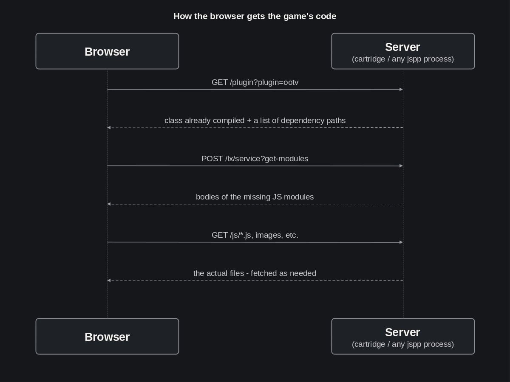
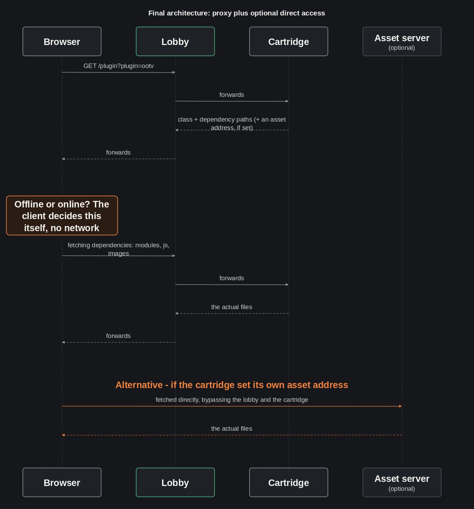

[LinkedIn](https://www.linkedin.com/pulse/lets-go-play-part-4-how-we-checked-our-own-intuition-aleksei-sedov-qmdnf/)

# Let's Go Play! Part 4: How We Checked Our Own Intuition

---

> #### Epigraph
> *Trust not your eyes - trust the numbers.*

Greetings again!

[Last time](https://www.linkedin.com/pulse/lets-go-play-part-3-what-matters-more-plan-aleksei-sedov-t0upf)
the offline version of Outposts of the Void came alive. Online mode is
next, and that needs a full implementation of the lobby↔cartridge
interaction. Right now, the lobby has gained a full UI, Claude got its
first serious hands-on time with my platform's frontend, and one important
architectural question got resolved. This report is about doubt,
searching, and a rational approach - but let's take it in order.

## The Lobby Gets a Face

Until now the lobby existed only as a backend protocol. It needed a real
GUI. We started with the markup - a couple of layout options, no logic
yet. One was the classic web-page layout, with scrolling; the other fit
exactly into the browser window, no scrolling, closer to a desktop app. I
picked the second one, with the constraint that launching a game had to
happen without leaving the page.

## Claude Learns to Work With `lxgo`'s Frontend

In my framework, the frontend is built from GUI nodes. Claude started
building the interface in one big file and ended up with a God-object. I
split the node into several - a header, the table list, the game card,
match details. I showed Claude a reference and sent it off to rework the
decomposed frontend. At first it wired these pieces together directly -
one node calling another's methods. I rejected that too: on my platform,
GUI nodes aren't supposed to know about each other that tightly -
communication goes through a shared event system. My buddy Claude also
tripped over a subtlety: the order in which sibling UI pieces get
constructed isn't guaranteed. There is, however, a reliably safe point
where shared state is guaranteed to already exist. This always seemed
fairly obvious to me, but it turned out I had to explain explicitly how
it actually works.

Next we tackled interactive state updates. At first Claude implemented
full-rerender methods for interface fragments. The platform actually has
proper reactivity built in, based on models bound to widgets. It turned
out this part was under-documented (a backlog task now exists for that),
so I had to explain to Claude how our reactivity actually works. What
came out of it was a skill dedicated to building frontend within the
`lxgo` platform's conventions.

## Meanwhile - an Unresolved Architecture Question

Once the frontend work was done, a question surfaced that's only
indirectly related to the interface itself: the lobby and the cartridge
are connected only by a service channel, while the game's code physically
lives on the cartridge's disk. At that point the game plugin was built as
a page served by the cartridge itself. The platform did support building
a plugin as an embeddable resource for a browser page, but it only
guaranteed compilation and asset loading through the same process whose
disk the plugin lives on - i.e. the cartridge. So how would a client who
already has the lobby page open ever get the full game code, if there's
no direct browser↔cartridge path at all?

The question came down to how to get the finished result to the browser.
There were two options:
- **Proxy on the lobby** - the lobby itself forwards the request for the
  game's code to the right cartridge, the browser keeps talking only to
  the lobby;
- **Direct access** - the lobby tells the browser a specific cartridge's
  address once, after which the browser goes there itself, no
  middleman.

We put both options into a table of pros and cons with points (up to
100) - each item carrying its own weight. The scoring was approximate,
but having several criteria made the overall assessment more objective.
The first pass gave a noticeable lead to the proxy option. Its main
advantage - the cartridge stays closed off from the internet; direct
access's main drawback - revisiting the originally planned architecture.

We'd already changed plans once before, and this time I thought - how bad
would it really be to revisit the architecture again, if it meant
significantly simpler work going forward? On that basis, direct access's
main drawback could reasonably be scored much lower. On the other hand,
the security question, already scored fairly high, started to look like
an even bigger priority once it was broken down into concrete points. So
a re-scoring was needed. And although it intuitively seemed like one
option's lead might become less decisive, the gap only grew.

**Proxy on the lobby - before → after**

| Criterion | Before | After |
|---|---|---|
| Cartridge stays closed off from the internet | +90 | +95 |
| Single point for rate-limiting and DoS protection | +70 | +80 |
| Partially hides cartridge topology | +30 | +35 |
| Single point for the TLS certificate | +40 | +50 |
| Harder to debug | −10 | −10 |
| Needs a hand-rolled proxy layer | -25 | -10 |
| Lobby becomes a bottleneck for asset traffic | −50 | −50 |
| A required change in the platform itself | −70 | −35 |
| **Total** | **+75** | **+155** |

**Direct access - before → after**

| Criterion | Before | After |
|---|---|---|
| No platform changes needed | +70 | +35 |
| Simplifies further development | +50 | +20 |
| No hand-rolled proxy layer needed | +25 | +10 |
| Easier to debug | +10 | +10 |
| CORS - a new concern for every cartridge | −20 | −15 |
| TLS certificates multiply | −40 | −50 |
| Exposes internal cartridge topology | −30 | −35 |
| No single point for rate-limiting/protection | −70 | −80 |
| A shift in the threat model | −85 | −95 |
| Breaks the originally planned deployment architecture | −90 | −10 |
| **Total** | **−180** | **−210** |

In the end, we had good reason to stick with the plan after all.
Security's higher priority outweighed the big drop in how harshly we
scored revisiting the architecture. A useful lesson - intuition misleads
you, while numbers help clear away the noise. We'll keep using this
method going forward.

In the end, we got the behavior we needed. But along the way,
implementation turned up something extra: the platform changes now let us
control dependency fetching much more flexibly. A cartridge can now
specify its own arbitrary address for the browser to pull assets from
directly, bypassing the lobby - typically that's the cartridge's own
server, or more generally any separate asset server. Switching between
modes is now a matter of configuration - closedness or speed, picked per
deployment. As I've written in earlier articles, flexible functionality
falling naturally out of an architecture, as one of its possible
expressions, is a sign to me that we're on the right track.

## What's Next

The mechanism for delivering the game through the lobby is already
implemented - the hybrid of proxying and an optional direct asset address
from the diagram above. Next up is online mode for `Outposts of the
Void`: connecting through the lobby and syncing match state between
players over the network.

For convenience, here are the important links again:
* The framework - [https://github.com/epicoon/lxgo](https://github.com/epicoon/lxgo)
* The game engine - [https://github.com/epicoon/lx-games](https://github.com/epicoon/lx-games)

Thanks for reading - and, as always, I'll be glad to hear your comments
and questions `:)`
