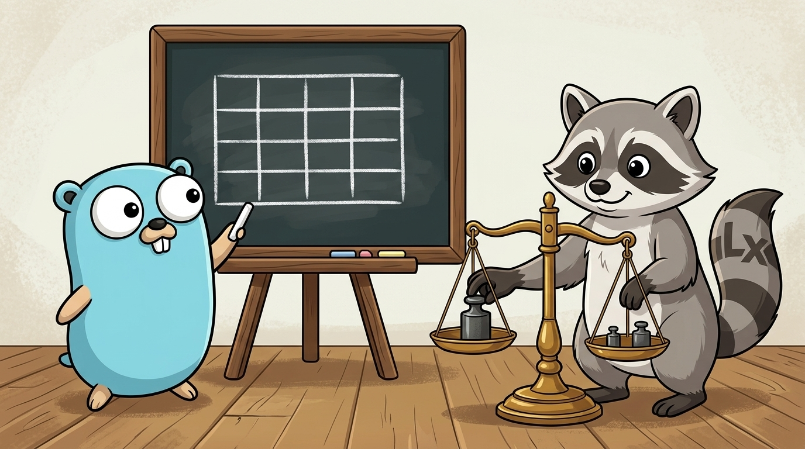
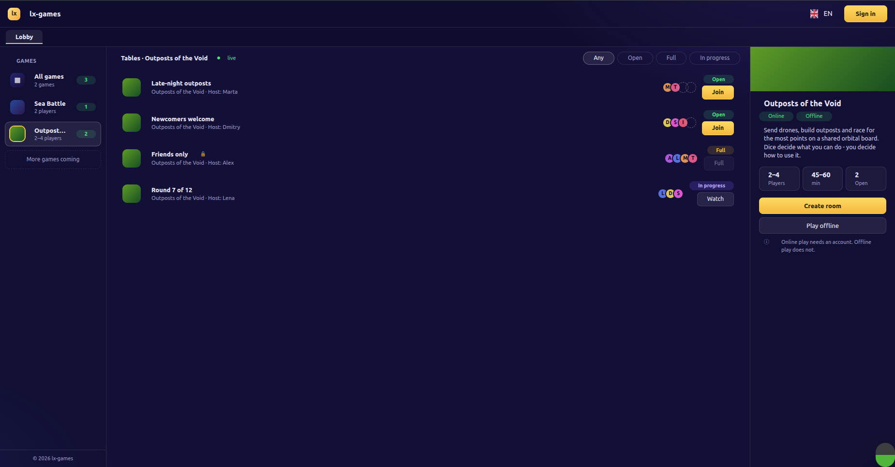
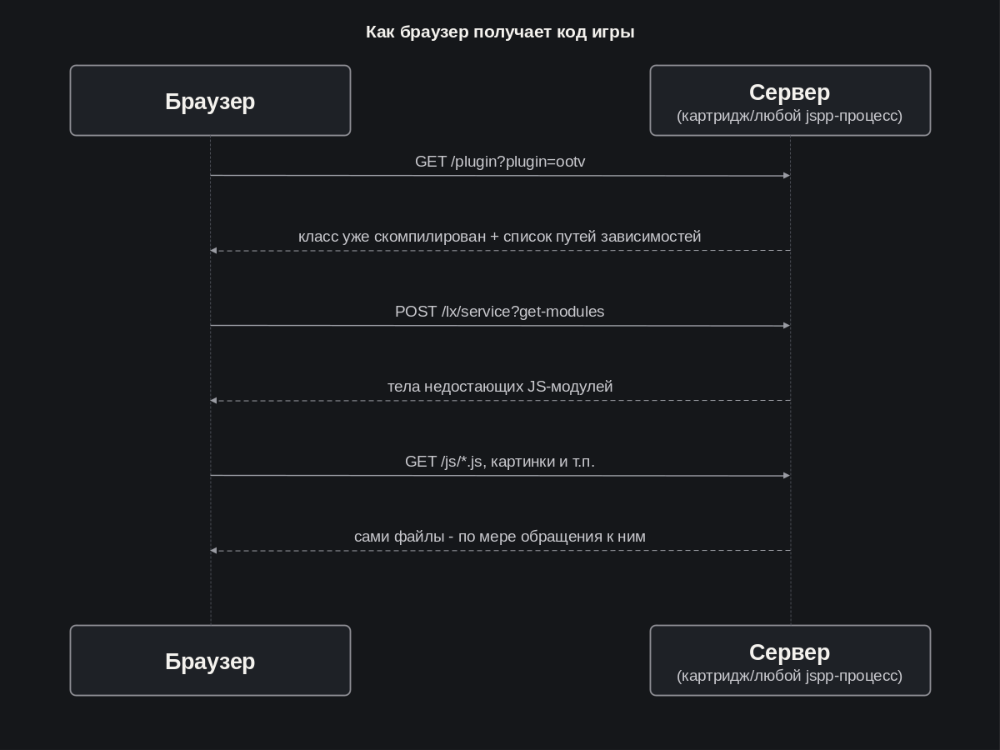
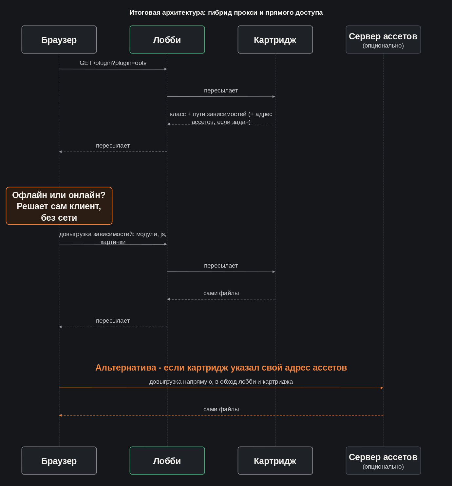

[LinkedIn](https://www.linkedin.com/pulse/lets-go-play-part-4-how-we-checked-our-own-intuition-aleksei-sedov-qmdnf/)

# Go, поиграем! Часть 4: как мы проверяли свою интуицию

---

> #### Эпиграф
> *Верь не глазам, верь числам.*

Приветствую снова!

В [прошлый раз](https://www.linkedin.com/pulse/lets-go-play-part-3-what-matters-more-plan-aleksei-sedov-t0upf)
ожила офлайн-версия Outposts of the Void. На очереди онлайн, для которого
потребуется уже полноценная реализация взаимодействия лобби↔картридж.
На текущий момент лобби обзавелось полноценным UI, Клод впервые плотно поработал
с фронтенд-частью моей платформы и был разрешён один важный архитектурный вопрос.
Этот отчёт про сомнения, поиск и рациональный подход, но обо всём по порядку.

## Лобби обрастает лицом

До этого лобби существовало как бэкенд-протокол. Нужно было собрать полноценный GUI.
Начали с вёрстки - пары вариантов компоновки без логики. Один - классический для
веб-страниц, со скроллом; второй - вписывался ровно в окно браузера целиком, без
прокрутки, больше похожий на десктоп-приложение. Выбрал второй вариант, причём
с учётом, что запуск игр должен происходить без ухода со страницы.

## Клод учится работать с фронтендом `lxgo`

В моей парадигме фронтенд строится из узлов графического интерфейса. Клод начал
собирать интерфейс в одном большом файле и получил God-object. Я разбил узел
на несколько - шапку, список столов, карточку игры, детали партии. Показал Клоду
референс и отправил дорабатывать декомпозированный фронтенд. Сначала он связал
эти части напрямую - один узел вызывал методы другого. Это я тоже завернул: в
моей платформе связанность между узлами графического интерфейса не приветствуется,
взаимодействие осуществляется через общую систему событий. Так же дружище Клод
попался на особенности, что порядок, в котором создаются соседние куски интерфейса,
не гарантирован. При этом существует заведомо безопасная точка, где общее состояние
уже существует. Этот момент мне всегда казался достаточно очевидным, но выяснилось,
что нужно отдельно объяснить как это работает.

Дальше стали разбираться с интерактивным обновлением состояния. Изначально Клод
реализовал методы полного ререндера фрагментов интерфейса. Платформой предусмотрена
полноценная реактивность, основанная на моделях и связывании их с виджетами.
Выяснилось, что эта часть документирована недостаточно (по поводу чего была
создана задача, пока в бэклог), мне пришлось объяснить Клоду как у нас работает
реактивность. По итогу получили скилл, отвечающий за построение фронтенда в
контексте `lxgo` платформы.

## А тем временем - нерешённый архитектурный вопрос

По итогу решения фронтенд-задач, всплыл вопрос, который к собственно интерфейсу
имеет опосредованное отношение: лобби и картридж связаны только служебным
каналом, а сам код игры физически лежит на диске картриджа. На тот момент
игровой плагин собирался как страница на стороне самого картриджа. Платформа
позволяла собрать плагин, как встраиваемый ресурс для страницы браузера, но
предусматривала компиляцию и гарантию подгрузки ассетов только тем процессом,
на чьём диске он лежит - то есть картриджем. Так как же клиент, открывший страницу
лобби, вообще получит полный код игры, если прямого пути браузер↔картридж нет?

Вопрос упирался в то, как донести готовый результат до браузера. Вариантов было два:
- **Прокси на лобби** - лобби само пересылает запрос за кодом игры на
  нужный картридж, браузер по-прежнему говорит только с лобби;
- **Прямой доступ** - лобби один раз подсказывает браузеру адрес
  конкретного картриджа, дальше браузер ходит туда сам, без посредника.

Свели оба варианта в таблицу плюсов и минусов с баллами (до 100) - у каждого
пункта своя сила влияния. Оценивали примерно, но за счёт того, что параметров
несколько, оценка становится объективнее. Первый проход дал ощутимый перевес
прокси-варианту. Его главный плюс - картридж остаётся закрытым от интернета;
главный минус прямого доступа - пересмотр изначально запланированной архитектуры.

Ранее мы уже меняли планы, и в этот раз я подумал - настолько ли плохо
пересмотреть архитектуру и теперь, если мы получим значительное упрощение дальнейшей
работы? Исходя из этого, основной минус прямого доступа к картриджу может быть
оценен значительно слабее. С другой стороны, вопрос безопасности, хоть и был
уже оценен достаточно высоко, будучи сформулированным в конкретных пунктах, начал
выглядеть приоритетнее. Поэтому переоценка была необходима. И хотя интуитивно казалось,
что лидерство одного из вариантов может стать менее явным, в итоге разрыв только
увеличился.

**Прокси на лобби - было → стало**

| Критерий | Было | Стало |
|---|---|---|
| Картридж остаётся закрыт от интернета | +90 | +95 |
| Единая точка rate-limiting и защиты от DoS | +70 | +80 |
| Частично скрывает топологию картриджей | +30 | +35 |
| Единая точка TLS-сертификата | +40 | +50 |
| Сложнее отлаживать | −10 | −10 |
| Нужен самописный прокси-слой | -25 | -10 |
| Лобби - узкое место по трафику ассетов | −50 | −50 |
| Обязательная правка в самой платформе | −70 | −35 |
| **Итого** | **+75** | **+155** |

**Прямой доступ - было → стало**

| Критерий | Было | Стало |
|---|---|---|
| Без доработок платформы | +70 | +35 |
| Упрощает дальнейшую разработку | +50 | +20 |
| Не нужен самописный прокси-слой | +25 | +10 |
| Проще отлаживать | +10 | +10 |
| CORS - новая забота на каждом картридже | −20 | −15 |
| TLS-сертификаты множатся | −40 | −50 |
| Раскрывает внутреннюю топологию картриджей | −30 | −35 |
| Нет единой точки rate-limiting/защиты | −70 | −80 |
| Смена модели угроз | −85 | −95 |
| Ломает исходную архитектуру развёртывания | −90 | −10 |
| **Итого** | **−180** | **−210** |

В результате обоснованно отказались отклоняться от плана. Повышение
приоритета безопасности перевесило значительное снижение критики к пересмотру
архутектуры. Полезный опыт - интуиция подводит, тогда как числа помогают очистить
ситуацию от шелухи. Будем пользоваться этим методом и впредь.

По итогу, получили необходимое поведение. Но в процессе реализации обнаружили,
что доработки платформы теперь позволяют управлять подтягиванием зависимостей
значительно гибче. Теперь картридж может указать собственный произвольный адрес,
откуда браузер тянет ассеты напрямую, в обход лобби - в частном случае это
собственный сервер картриджа, в общем случае - любой отдельный сервер ассетов.
Переключение между режимами теперь регулируется конфигурацией - закрытость или
скорость выбираются под конкретное развёртывание. Как я уже писал в предыдущих
статьях, для меня гибкая функциональность, вытекающая из архитектуры как вариант её
проявления - маркер, что мы на верном пути.

## Что дальше

Механизм доставки игры через лобби уже реализован - гибрид прокси и опционального
прямого адреса ассетов со схемы выше. Дальше нас ждёт онлайн-режим `Outposts of the Void`,
с подключением через лобби и синхронизацией состояния партии между игроками по сети.

Для удобства, продублирую важные ссылки:
* Фреймворк - [https://github.com/epicoon/lxgo](https://github.com/epicoon/lxgo)
* Игровой движок - [https://github.com/epicoon/lx-games](https://github.com/epicoon/lx-games)

Спасибо, что читаете - и, как обычно, буду рад комментариям и вопросам `:)`
